# AI Log Analyzer 🛡️


A Python-based Decision Support System (DSS) for analyzing Linux SSH authentication logs. It detects brute-force attack patterns and provides a risk assessment.

## 📂 Development Journey
This project was built using an **Agentic Workflow**, serving as a case study in AI-assisted software architecture.
- [📔 Architect's Journal](notes/architect_journal.md): Key technical decisions and personal reflections.
- [🗺️ Project Timeline](notes/agent_notes.md): From inception to "Senior-Level" hardening.
- [💬 Interaction Log](notes/keyprompts.md): A record of the prompt engineering used to drive development.
- [📸 Screenshots](screenshots/): Visual demonstrations of the tool in action.

## Features
- **Log Parsing**: regex-based parsing of standard Linux `auth.log` files.
- **Risk Analysis**: 
    - **High Risk**: > 5 failed attempts.
    - **Medium Risk**: > 3 failed attempts.
- **Reporting**: Outputs findings in Text or JSON format.

## Architecture
This project follows a modular architecture for testability and scalability:

```mermaid
graph LR
    A[📄 Raw Log] -->|Parse| B(⚙️ Log Parser)
    B -->|Analyze| C{🛡️ Risk Engine}
    C -->|Risk Data| D[📊 Assessment]
    
    D -->|Format| E(📝 Report Generator)
    D -->|Context| F(🧠 AI Insight)
    
    F -.->|API Call| G[☁️ Gemini]
    G -.->|Response| F
    
    F -->|Enrich| E
    
    E -->|Save| H[📄 report.txt]
    E -->|Save| I[📄 report.json]
```



### Components
- `src/log_parser.py`: Handles raw log ingestion with Regex.
- `src/risk_engine.py`: Contains the core logic for threat detection.
- `src/reporter.py`: Manages output formatting.
- `src/main.py`: Entry point CLI & AI Integration.

## HOW TO USE 🚀

1. **Clone & Setup**:

    git clone https://github.com/AaryanPandey-BIT/AI_Log_Analyzer.git
    cd AI_Log_Analyzer
    pip install -r requirements.txt
    ```

2. **Run Analysis**:
   ```bash
   python src/main.py Data/sample_auth.log
   ```

3. **View Results**:
   The tool automatically generates reports in the `output/` directory:
   - `output/report.txt`: Human-readable summary.
   - `output/report.json`: Machine-readable data.

## AI Features (Smart Summary) 🤖
To enable standard SSH log analysis, no extra setup is needed. 
To enable the **AI Smart Summary** (powered by Google Gemini), follow these steps:

1. **Get a Free API Key**:
   - Go to [Google AI Studio](https://aistudio.google.com/).
   - Create a new API Key.

2. **Configure Environment**:
   - Create a `.env` file in the project root (or rename the template).
   - Add your key: `GEMINI_API_KEY=your_actual_key_here`

3. **Install Dependencies**:
   ```bash
   pip install -r requirements.txt
   ```
   *(Note: These are pre-installed in this environment)*

## Features & Robustness
- **Flexible Parsing**: Handles variable whitespace and differing timestamp formats.
- **Error Resilience**: Skips malformed lines without crashing.
- **AI-Powered Insights**: (Optional) Uses LLMs to summarize security risks in plain English.


## Testing
Run the test suite using `pytest`:
```bash
pip install pytest
pytest tests/
```

## Example Output
```
=== Security Identification Report ===
IP: 192.168.1.100
Risk Level: HIGH
Description: Detected 6 failed login attempts from 192.168.1.100.
------------------------------
```
